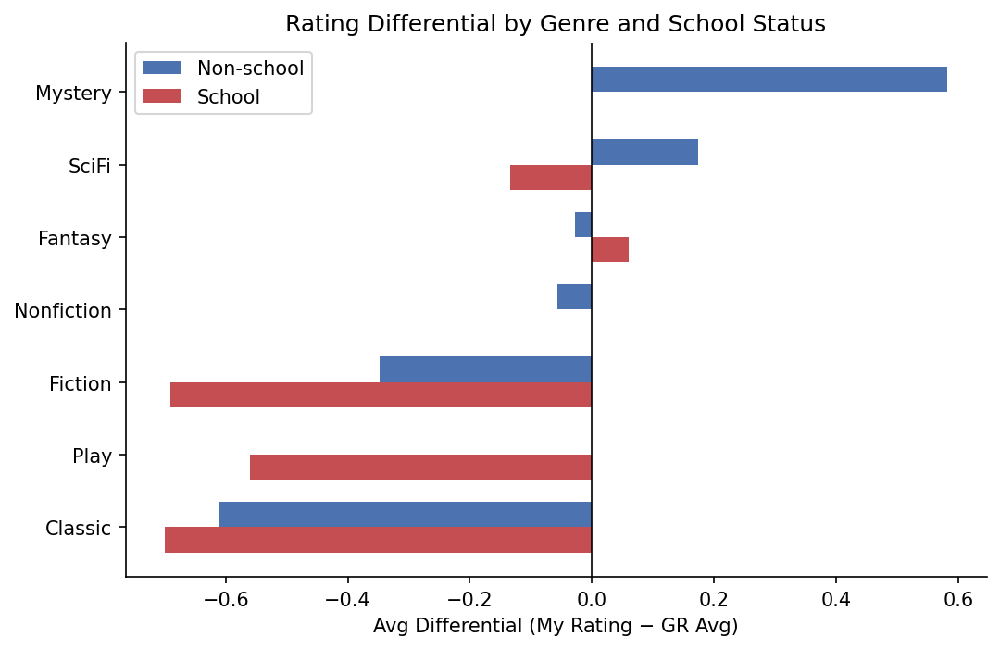
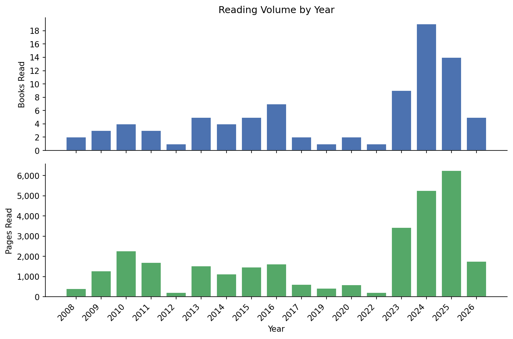

# Book Ratings

Personal reading tracker and recommendation engine built on my own rating history.

## Dataset

`input_tables/Reading_data_table.csv` — 86 rated books, tracking:

| Column | Description |
|---|---|
| Title, Author | Book identity |
| Release | Publication year |
| Pages | Page count |
| Avg Rating | Goodreads community average |
| FTR | My rating (1–5, half-star increments) |
| School? | 1 if assigned reading |
| Series Name / Number | Series membership and position |
| Genre 1 / 2 / 3 | Genre tags (primary → tertiary) |

`input_tables/want_to_read_list.csv` — 27 candidate books in the same schema (no rating yet).

## Analysis

Run `py analyze.py` to print a summary and save it to `analysis_outputs/analysis_output.txt`.

Covers: overall averages, school vs. non-school differential, per-genre breakdown, rating distribution, top/bottom books, authors with multiple books read.

Run `py plots.py` to regenerate all nine plots in `analysis_outputs/`.

### School vs. non-school differential by genre

Books read for school are rated consistently lower relative to the Goodreads average (−0.47 differential) than leisure reads (−0.03). The effect is strongest in Fiction and Classics.



### Reading volume by year



## Recommender

A Ridge regression model trained on the differential (my rating − GR avg), so predictions personalise around the Goodreads baseline rather than replacing it.

```
predicted rating = GR avg + predicted differential   (clamped to [1, 5])
```

### Pipeline

| Script | Purpose |
|---|---|
| `recommender/fetch.py` | Pulls descriptions and metadata from Google Books API; results cached in `recommender/cache/books.json` |
| `recommender/features.py` | Builds feature vectors for any book |
| `recommender/model.py` | Trains and saves `recommender/model.json` |
| `recommender/recommend.py` | Scores the want-to-read list and saves `analysis_outputs/recommendations.txt` |

### Features (14 total)

- **Goodreads avg** — strong population-level signal
- **Genre averages** — my position-weighted historical avg for each genre tag (Genre 1 / 2 / 3), where a primary tag contributes more to the genre average than an incidental one
- **Author avg + count** — how I've rated this author's prior books
- **Series avg + count + position** — series-level history
- **Log pages** — book length (log-scaled to dampen outlier effect)
- **Publication year**
- **School flag** — whether this would be assigned reading
- **Description similarity avg + score** — similarity-weighted avg rating of the 3 most similar books in my read history, matched by TF-IDF cosine similarity on descriptions

### Model performance

Trained on 86 books with 5-fold cross-validation:

| Metric | Value |
|---|---|
| CV MAE | 0.263 |
| Train MAE | 0.206 |
| Naive baseline (predict diff=0) | 0.578 |

Top features by coefficient magnitude: `author_avg`, `desc_sim_avg`, `gr_avg`.

### Usage

```bash
# fetch descriptions for all books (requires GOOGLE_BOOKS_API_KEY env var)
py recommender/fetch.py --batch input_tables/want_to_read_list.csv

# train / retrain the model
py recommender/model.py

# score the want-to-read list
py recommender/recommend.py

# sort by GR avg instead of predicted rating
py recommender/recommend.py --sort gr

# inspect features for any book
py recommender/features.py "Dune"
```

## Requirements

```
numpy
scikit-learn
matplotlib
requests        # fetch.py only
```
